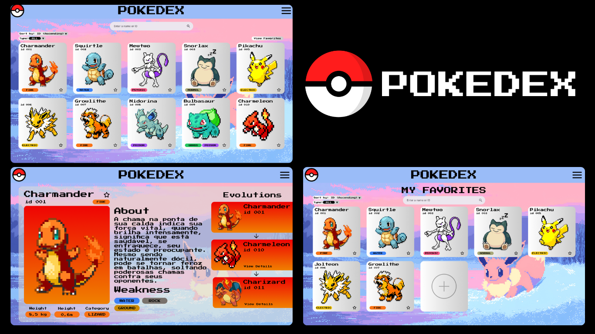

<h1 align="center"> Pokedex </h1>

Projeto UniAmérica, desenvolvimento WEB  

  <a href="#-tecnologias">Tecnologias</a>&nbsp;&nbsp;&nbsp;|&nbsp;&nbsp;&nbsp;
  <a href="#-projeto">Projeto</a>&nbsp;&nbsp;&nbsp;

 

  

## 🚀 Tecnologias

Esse projeto foi desenvolvido com as seguintes tecnologias:

- HTML e CSS
- JavaScript
- Git e Github
- Figma

## 💻 Projeto

A pokedex é um local onde o usuário pode obter informações sobre Pokemons.

Desenvolvido por: 

  <a>Kauã Marcelo</a>&nbsp;&nbsp;&nbsp;|&nbsp;&nbsp;&nbsp;
  <a>Gabriel Fukuro</a>&nbsp;&nbsp;&nbsp;|&nbsp;&nbsp;&nbsp;
  <a>Giovany Emanuel</a>&nbsp;&nbsp;&nbsp;|&nbsp;&nbsp;&nbsp;
  <a>Samuel Vieira</a>&nbsp;&nbsp;&nbsp;

---
